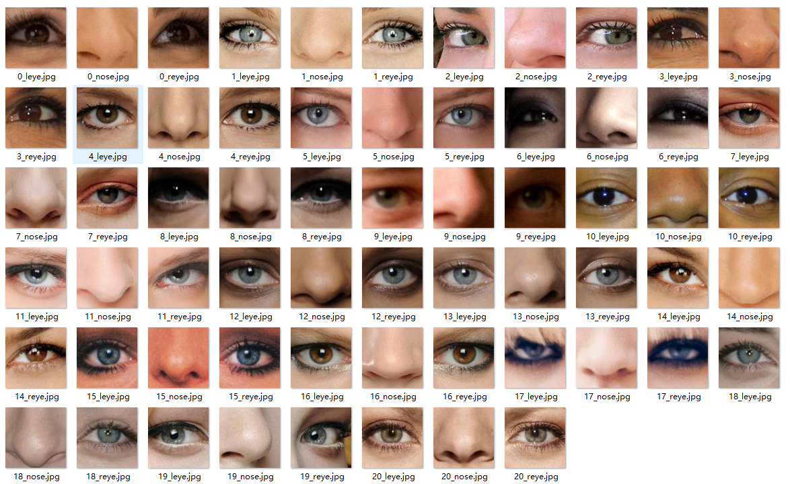
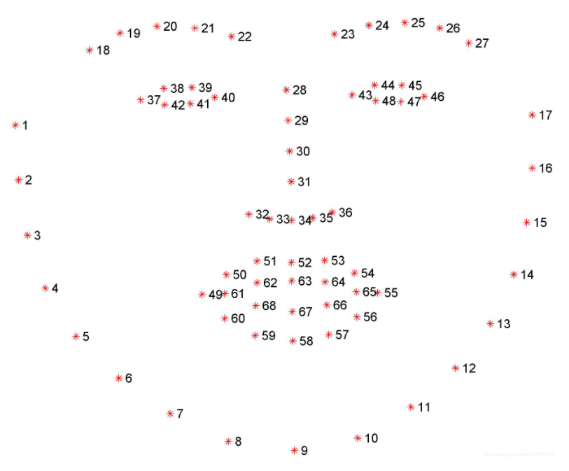

# Face Mask Segmentation
Face recognition and attribute segmentation using [Python](https://www.python.org/), [dlib](http://dlib.net/), and [One Millisecond Face Alignment with an Ensemble of Regression Trees](http://www.cv-foundation.org/openaccess/content_cvpr_2014/papers/Kazemi_One_Millisecond_Face_2014_CVPR_paper.pdf).

The dlib installation in windows platform you can infer [my blog:](https://blog.csdn.net/jianglw1/article/details/110942231)

### Examples

Command:

```python
python project.py
```

#### Data：


#### Output：

I extract the nose，eyes  attributes mask




### Method

First We selected some pictures from CelebA-HQ，and use [dlib](http://dlib.net/) to recognition and location some our wanted attributes. 

Take nose as a example, choose 29-36 as my index referring to the picture below, then compute their midpoint. In the last, intercept the mask by midpoint and our patch_size(output size).




